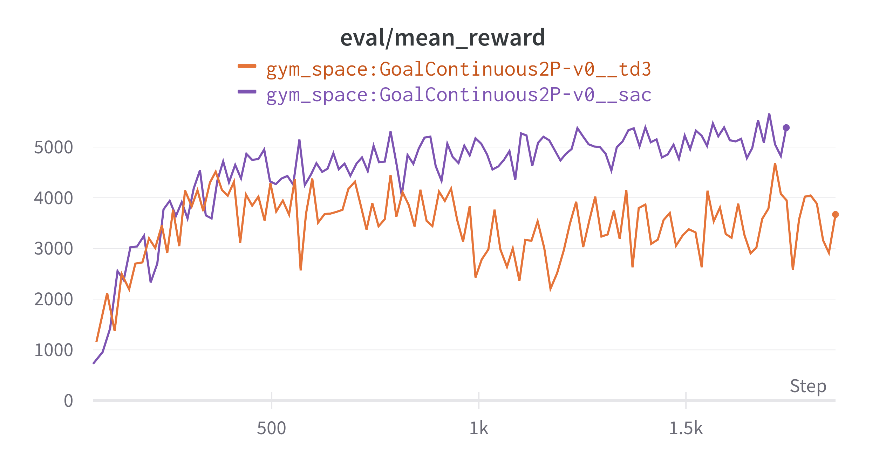
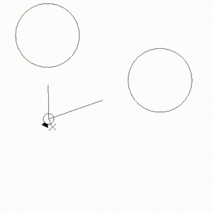
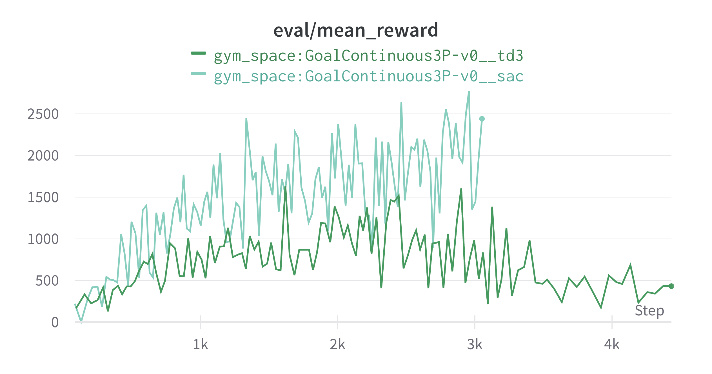
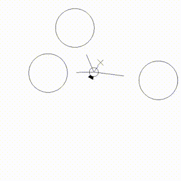
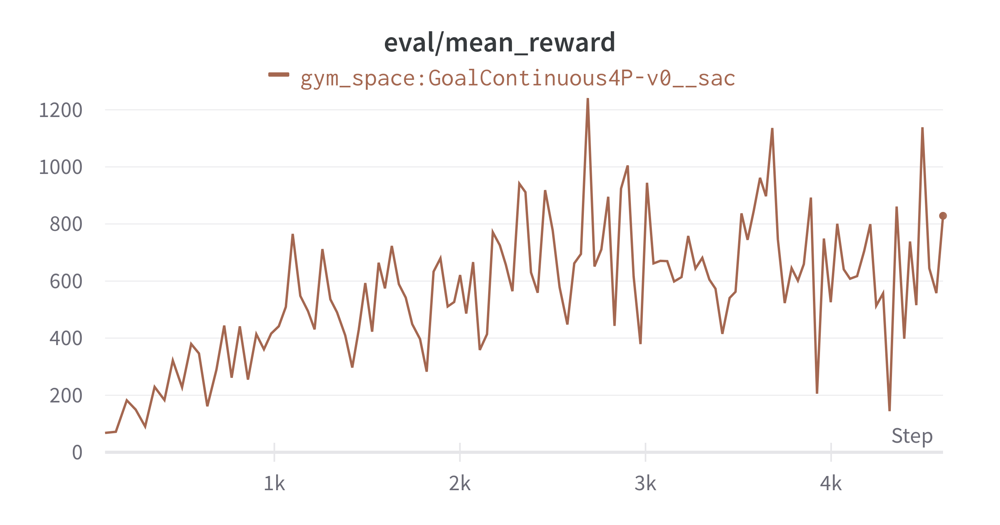
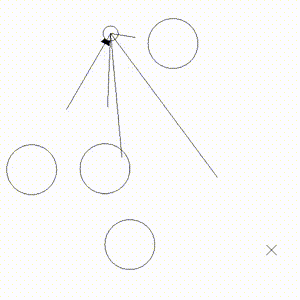
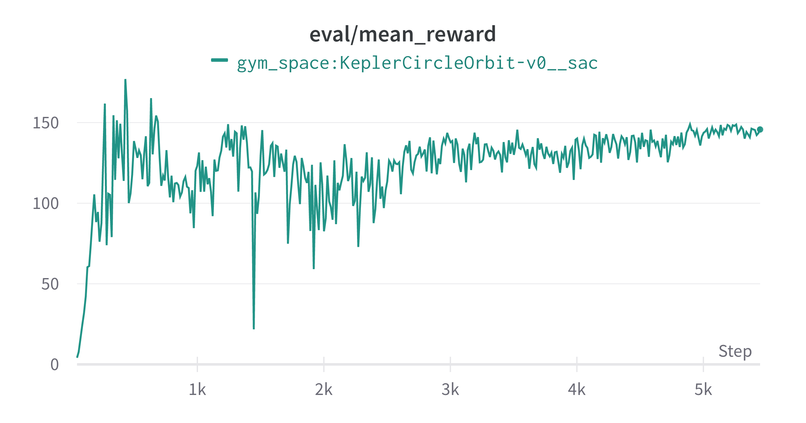
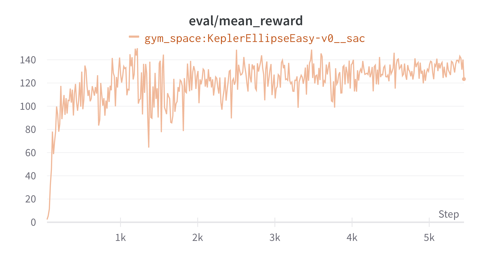
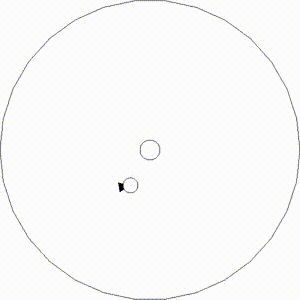

# Space-Gym
Set of RL environments with locomotion tasks in space. 
The goal is to navigate a (planar) spaceship to reach the prescribed goals, or enter a prescribed orbit.
We define a few tasks with varying difficulty. Some of the tasks we created are hard for state-of-the-art
off-policy algorithms (SAC, TD3). 

We learned a lot by the environments design process, and we find it particullary challenging to appropriately 
shape the reward function, such that the RL algorithm converges to a satisfactory control. 

The goal of the repository is to share it with the community as a benchmark that can be used to test suitable
reinforcement learning methods and algorithms. We believe that all of the tasks can be solved in a much better
way than demonstrated. 

Authors : Jacek Cyranka & Kajetan Janiak (University of Warsaw)

A paper with extended versions of the environments is currently under preparation.

In case you have a feedback or any questions/requests concerining the Space-Gym envs do not hessitate to post an issue here
or send it to the author(s) by a direct mail.

# Installation
`pip install -e .`, then see example in `keyboard_agent.py`

# Environments

### GoalEnv
Navigate spaceship to achieve subsequent goal positions while avoiding
crusing on any planet and leaving the world (window) boundaries.

Parameters:

 - `n_planets` - number of planets to avoid
 - `survival_reward_scale` - fraction of reward for staying alive (not crashing)
 - `goal_vel_reward_scale` - fraction of reward for velocity toward current goal
 - `safety_reward_scale` - fraction of reward for not flying fast toward close obstacles
 - `goal_sparse_reward` - reward for achieving a goal
 - `ship_steering` - if ship is steered by the angular velocity (the action sets the angular velocity) or the angular acceleration (the action sets the angular acceleration), then the ship has fixed moment of intertia (set using another parameter `ship_moi`)

For the exact formula of the reward please refer to `GoalEnv._reward()` in `gym_space/envs/goal.py`. 

There are several difficulty levels. For each level we provide the rewards achieved by the best RL method that we tested and the Human baseline score, obtained using the so-called keyboard-agent (see `keyboard_agent.py`)

 1. two planets present within the region boundaries (there is predefined env with default parameters `GoalContinuous2P-v0`), it is easily solved by off policy RL algorithms (SAC & TD3).
 2. three planets present within the boundaries (there is predefined env with default parameters `GoalContinuous3P-v0`), much harder challenge than two planets, all of the tested RL methods have issues grasping how to use gravity and avoid crashing on a planet.
 3. four planets present within the boundaries (there is predefined env with default parameters `GoalContinuous4P-v0`), this environment is not solvable and the policy is not able to avoid continuously crasing on a planet.

### Kepler Orbit Env

Control spaceship to enter a specified orbit from any initial condition utilizing the least energy.

Parameters:
 - `ship_steering` - if ship is steered by the angular velocity (the action sets the angular velocity) or the angular acceleration (the action sets the angular acceleration), then the ship has fixed moment of intertia (set using another parameter `ship_moi`).
 - `rad_penalty_C` - penalty term coefficient for the distance to the reference orbit radius (reward is inversely proportional to the distance). 
 - `numerator_C` - the constant in the denominator of the step-wise reward value, and added in the denominator (hence the maximal step-wise reward is `1`).
 - `act_penalty_C` - penalty term coefficient for the energy utilized to perform the action during the current step.
 - `step_size` - the numerical integrator step size.
 - `randomize`- if the orbit should be randomized at every reset (then the parameters of the orbit are appended to the observation vector).
 - `ref_orbit_a`, `ref_orbit_eccentricity`, `ref_orbit_angle` if the orbit is fixed, the reference parameters of the target orbit.

The reward is also inversely proportional to the absolute distance of the current velocity to the reference orbit velocity, which is easily computed for the [Kepler orbits](https://en.wikipedia.org/wiki/Kepler_orbit).

For the exact formula of the reward please refer to `KeplerEnv._reward()` in `gym_space/envs/kepler.py`.

# Preliminary Training Results

We perofrmed a bunch of a trainings using the [Stable-baselines3](https://github.com/DLR-RM/stable-baselines3) software, in particular the [rl-baselines3-zoo](https://github.com/DLR-RM/rl-baselines3-zoo). We used the default hyperparameters of TD3, SAC. PPO performed significantly worse. A preliminary hyperparameter optimization that we performed showed no significant improvements over the default ones.

### GoalEnv

#### 2 Planets
 

Human baseline score (mean/std.dev. from 5 episodes) measured using `keyboard_agent.py` 4715 +- 799

#### 3 Planets
 

Human baseline score (mean/std.dev. from 5 episodes) measured using `keyboard_agent.py` 4659 +-747

#### 4 Planets
 

### Kepler Orbit Env

#### Circle Orbit
 

#### Ellipsoidal Orbit
 

# Conclusions and Future Work

There is still a significant room for improving the performance of RL agents in the presented environments. One particulary promising direction is to try a safety RL method. We expect that better shaped reward functions and extended observation vectors may result in significant performance improvements as well.

We could not explain the dramatic performance drop when increasing the number of planets from 2 upto 3. The measured human baseline score is similar for the 2 planets env. and is significantly smaller for the case of 3 planets.

# Implementation Remarks

### Environments

There are six non-abstract environment classes.
Three with discrete and three with continuous action spaces,
defined in `envs/do_not_crash.py`, `envs/kepler.py`, `envs/goal.py`.  

All of them inherit from abstract base class `SpaceshipEnv`
defined in `envs/spaceship_env.py`.
This class takes care of physics, actions, collisions etc.
Child classes have to instantiate base class with selected
parameters values and implement `_reset` and `_reward` methods.

### Physical dynamic

All code responsible for physics simulation is in `dynamic_model.py`.
Please refer to the docstrings in that file. 

### Rendering

Class `Renderer` in `rendering.py` is responsible for visualization
of the environment. The class won't be instantiated and nothing will be drawn
unless `render()` method of an environment is called.  

Parameters `num_prev_pos_vis` and `prev_pos_color_decay` allow you to control
how the tail trailing the ship position looks and how long it is.

### GoalEnv initial position sampling

In order to make initial position sampling for large number of planets efficient,
we implemented an algorithm based on hexagonal tiling of a plane.
Related code is in `hexagonal_tiling.py`. To make sense of it, please refer to `notebooks/hexagonal_tiling.ipynb`.

# Stable-Baselines 3 starting agents
TBA

### License
Copyright 2021 Jacek Cyranka & Kajetan Janiak (University of Warsaw)

Licensed under the Apache License, Version 2.0 (the "License");
you may not use this file except in compliance with the License.
You may obtain a copy of the License at

   http://www.apache.org/licenses/LICENSE-2.0

Unless required by applicable law or agreed to in writing, software
distributed under the License is distributed on an "AS IS" BASIS,
WITHOUT WARRANTIES OR CONDITIONS OF ANY KIND, either express or implied.
See the License for the specific language governing permissions and
limitations under the License.
